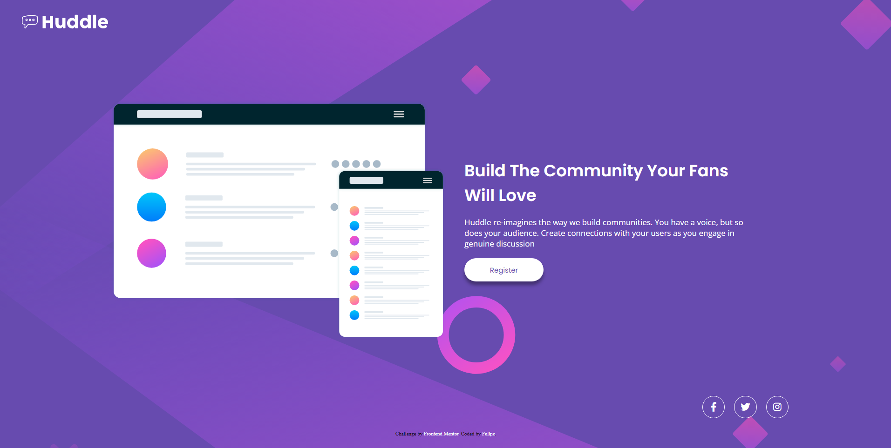

# Frontend Mentor - Quest

Esta é uma solução para o [desafio da página inicial do Huddle com uma única seção introdutória no Frontend Mentor](https://www.frontendmentor.io/challenges/huddle-landing-page-with-a-single-introductory-section-B_2Wvxgi0) . Os desafios do Frontend Mentor ajudam você a melhorar suas habilidades de codificação criando projetos realistas.

## Índice

- [Visão geral](#Visão-geral)
  - [O desafio](#o-desafio)
  - [Captura de tela](#captura-de-tela)
  - [Links](#links)
- [Meu processo](#meu-processo)
  - [Construído com](#construído-com)
  - [O que aprendi](#o-que-aprendi)
  - [Desenvolvimento contínuo](#desenvolvimento-contínuo)
  - [Recursos úteis](#recursos-úteis)
- [Autor](#autor)
- [Agradecimentos](#agradecimentos)

## Visão geral

### O desafio

Os usuários devem ser capazes de:

- Visualize o layout ideal para a página, dependendo do tamanho da tela do dispositivo
- Veja os estados de foco para todos os elementos interativos na página

### Captura de tela

### Links

- URL da solução: [https://github.com/gitFellpz/quest-devQuest#o-desafio](https://github.com/gitFellpz/quest-devQuest#o-desafio)
- URL do site ao vivo: [https://gitfellpz.github.io/](https://gitfellpz.github.io/)
- obs: Provavelmente essa url ao vivo vai estar com outro site na hospedagem. Faço vários projetos no git pages.

## Meu processo

### Construído com

- Marcação HTML5 semântica
- Propriedades personalizadas de CSS
- Flexbox
- Grade CSS
- Ícones com Font-Awesome

### Desenvolvimento contínuo

Pretendo continuar o estudo em front-end por bastante tempo, principalmente na parte mais "básica" (HTML e CSS). Ainda não estou totalmente confortável com meus resultados. Sinto que minha responsividade não fica tão boa como vejo nas aulas, mas o desenvolvimento contínuo está aqui.

### Recursos úteis

- [Font Awesome](https://fontawesome.com/) - O font-awesome me ajudou bastante com os ícones de redes sociais. Bem mais simples de trabalhar e achar essas "imagens".

## Autor

- Mentor de frontend - [@gitFellpz](https://www.frontendmentor.io/profile/gitFellpz)
- Github - [@gitFellpz](https://github.com/gitFellpz/)
